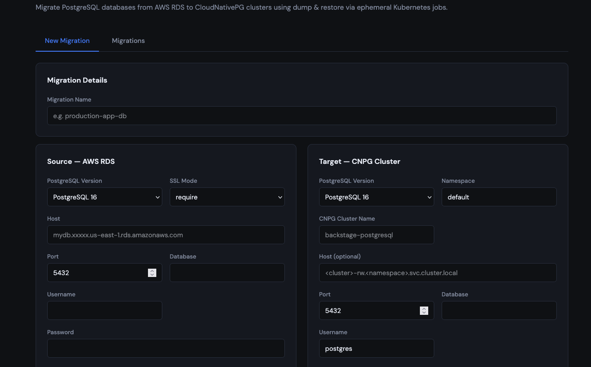
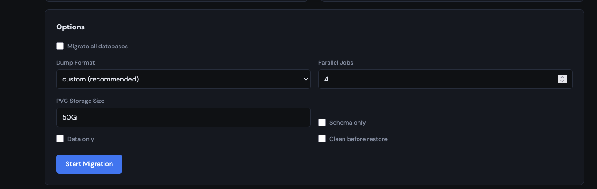
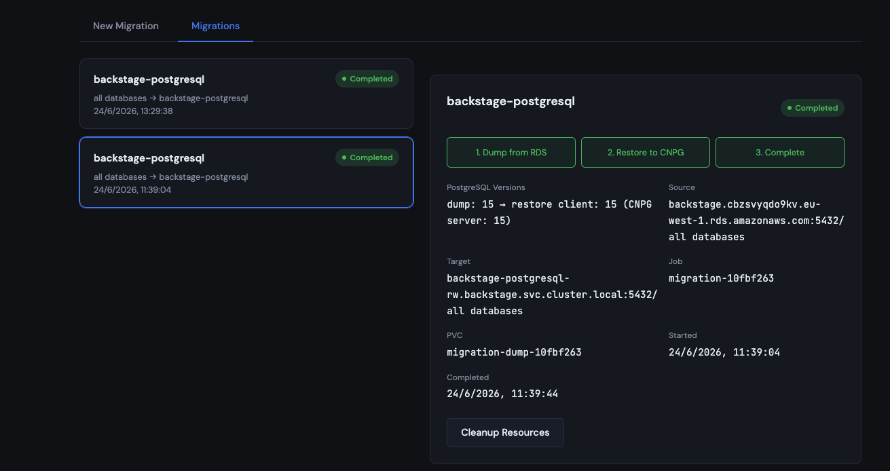
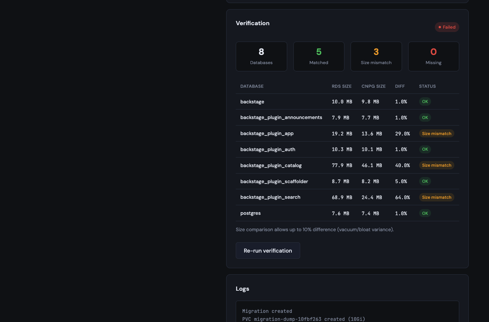
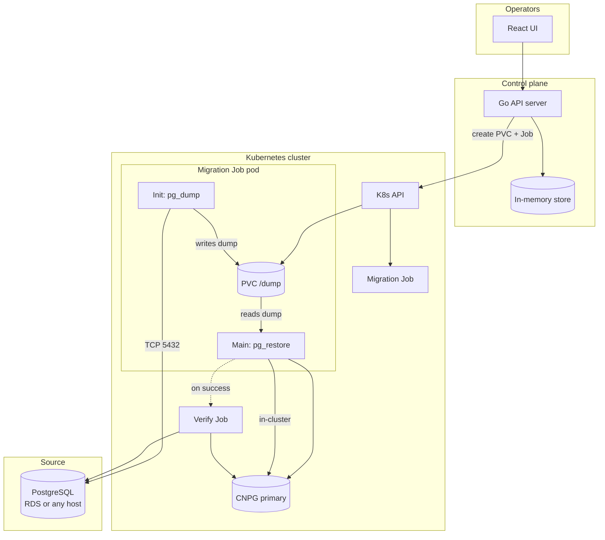

# CNPG Migrator

[](https://github.com/kaskol10/cnpg-migrator/actions/workflows/ci.yml)
[](https://github.com/kaskol10/cnpg-migrator/actions/workflows/release.yml)

A web-based tool to migrate PostgreSQL databases to **CloudNativePG (CNPG)** clusters running in Kubernetes.

The primary use case is moving off **AWS RDS** (or any external PostgreSQL) onto CNPG using a **dump & restore** workflow orchestrated by ephemeral Kubernetes Jobs.

## Screenshots

**New migration** — configure source (RDS) and target (CNPG) endpoints:



**Options** — dump format, parallelism, PVC size, and restore mode:



**Migration status** — progress through dump, restore, and completion:



**Verification & logs** — per-database size comparison and job output:



## Why migrate to CloudNativePG?

Running PostgreSQL on RDS works, but it sits **outside** your Kubernetes control plane:

- **Cost** — RDS bills for the instance, storage, I/O, backups, and cross-AZ traffic. For many workloads, Postgres on the nodes you already run (via CNPG) is significantly cheaper at comparable reliability.
- **Kubernetes-native operations** — CNPG is an operator: clusters, failover, backups, and restores are CRDs and Jobs you manage like any other app — not a separate AWS console workflow.
- **Backup & restore** — CNPG integrates with object storage (S3, GCS, Azure Blob). Scheduled backups, PITR, and restore into a new cluster are first-class operator features.
- **Portability** — Same pattern on any cloud or on-prem. You are not locked into one vendor's managed database pricing and networking model.

RDS does **not** support bootstrapping CNPG via physical replication. The practical path is logical migration: `pg_dump` → `pg_restore`. This tool automates that inside Kubernetes so migrations are repeatable, observable, and aligned with how you already run CNPG.

## Architecture



### Migration flow

1. Operator submits source (PostgreSQL), target (CNPG), and options via the UI.
2. API creates a **PVC** and a **Job** with two containers:
   - **Init container** (`postgres:<source_version>`) runs `pg_dump`
   - **Main container** (`postgres:<max(source,target)>`) runs `pg_restore`
3. Backend polls job status and pod logs; the UI shows progress and verification results.

## Features

- Web UI for migration configuration and status
- Version-aware `pg_dump` / `pg_restore` client images
- Single-database or all-databases migration
- Post-migration verification (database presence and size comparison)
- Optional ownership and grant preservation (with role migration from source)
- Skip extension restore for CNPG-managed extensions (default on)
- Helm chart for deployment

## Limitations

- **Logical migration only** — requires a maintenance window; not zero-downtime replication.
- **Ownership** — by default objects are restored as the target user (`--no-owner --no-acl`). Enable **Preserve ownership and grants** in the UI to keep source owners and ACLs; use **Migrate roles from source** to create matching roles on CNPG first (RDS system roles are excluded). Role passwords are not copied (`--no-role-passwords`).
- **Extensions** — CNPG often manages extensions via the Cluster `databases[].extensions` spec. **Skip extensions on restore** (default on) omits `CREATE EXTENSION` from `pg_restore` so the operator-provisioned extensions are used instead. The restore user is not a superuser on CNPG.
- **Version downgrades** may fail (e.g. PG16 → PG15).
- **No built-in authentication** on the UI — do not expose publicly without an auth layer (OAuth2 proxy, VPN, etc.).
- **Credentials** are passed to Job pods as environment variables (Kubernetes Secrets integration is on the roadmap).

## Prerequisites

- Go 1.22+
- Node.js 20+
- Kubernetes cluster with the [CloudNativePG operator](https://cloudnative-pg.io/)
- Helm 3 (for deployment)
- Network path from migration pods to source PostgreSQL and CNPG
- A `StorageClass` supporting `ReadWriteOnce` PVCs

## Quick start (local development)

```bash
make tidy
cd frontend && npm install

# Terminal 1 — API (uses ~/.kube/config)
export NAMESPACE=cnpg-migrator
make backend

# Terminal 2 — UI dev server
make frontend
```

Open http://localhost:5173

## Deploy with Helm

Images and charts are published to [GitHub Container Registry](https://github.com/kaskol10/cnpg-migrator/pkgs/container/cnpg-migrator) on every push to `main`. Tag a release with `v0.1.0` to publish semver versions.

### From GHCR (recommended)

```bash
helm upgrade --install cnpg-migrator oci://ghcr.io/kaskol10/charts/cnpg-migrator \
  --version 0.1.0 \
  --namespace cnpg-migrator \
  --create-namespace
```

The chart defaults to `ghcr.io/kaskol10/cnpg-migrator` with `image.tag` matching the chart `appVersion`. For `main` builds, use the chart version shown in the [Release workflow](https://github.com/kaskol10/cnpg-migrator/actions/workflows/release.yml) summary (e.g. `0.1.0+abc1234`).

### From source

```bash
helm upgrade --install cnpg-migrator k8s/helm/cnpg-migrator \
  --namespace cnpg-migrator \
  --create-namespace \
  --set image.repository=ghcr.io/kaskol10/cnpg-migrator \
  --set image.tag=latest
```

Port-forward to access the UI:

```bash
kubectl port-forward -n cnpg-migrator svc/cnpg-migrator 8080:80
```

See [k8s/README.md](k8s/README.md) for ingress, job scheduling, and values reference.

### CNPG target host

Restore defaults to `<cluster>-rw.<namespace>.svc.cluster.local`. The **cluster name must match the CNPG Cluster resource name**.

Example: if `kubectl get svc -n backstage` shows `backstage-postgresql-rw`:

- **CNPG Cluster Name**: `backstage-postgresql`
- **Namespace**: `backstage`

Or set **Host** explicitly to `backstage-postgresql-rw.backstage.svc.cluster.local`.

## Configuration

| Environment Variable     | Default           | Description |
|--------------------------|-------------------|-------------|
| `ADDR`                   | `:8080`           | HTTP listen address |
| `NAMESPACE`              | `cnpg-migrator`   | Namespace for migration Jobs and PVCs |
| `IN_CLUSTER`             | `false`           | Use in-cluster kubeconfig |
| `POSTGRES_VERSIONS`      | `13,14,15,16,17`  | Major versions in the UI |
| `POSTGRES_IMAGE_PREFIX`  | `postgres:`       | Image prefix (`postgres:16`) |
| `POSTGRES_IMAGES`        | —                 | Override: `16=postgres:16` |
| `DEFAULT_SOURCE_VERSION` | latest in list    | Default source version |
| `DEFAULT_TARGET_VERSION` | latest in list    | Default target version |
| `DEFAULT_STORAGE_SIZE`   | `50Gi`            | Default PVC size |
| `NODE_SELECTOR`          | —                 | Job pod node selector (`key=value,...`) |
| `TOLERATIONS`            | —                 | Job tolerations (`key=value:NoSchedule;...`) |
| `POLL_INTERVAL_SEC`      | `5`               | Job polling interval |

The `pg_restore` **client** uses the newer of source and target versions. Downgrading server versions may still fail if the dump uses newer features.

## API

| Method | Path | Description |
|--------|------|-------------|
| GET | `/health` | Health check |
| GET | `/api/v1/config` | Available PostgreSQL versions |
| GET | `/api/v1/migrations` | List migrations |
| POST | `/api/v1/migrations` | Create migration |
| GET | `/api/v1/migrations/{id}` | Get status |
| GET | `/api/v1/migrations/{id}/logs` | Get logs |
| POST | `/api/v1/migrations/{id}/verify` | Run verification |
| GET | `/api/v1/migrations/{id}/verification` | Verification results |
| POST | `/api/v1/migrations/{id}/cancel` | Cancel migration |
| DELETE | `/api/v1/migrations/{id}/resources` | Delete job and PVC |

## Build

The Docker image is published for **linux/amd64** and **linux/arm64**:

```bash
make docker
make docker-push IMAGE=ghcr.io/kaskol10/cnpg-migrator:0.1.0
```

Or cut a release tag — CI publishes automatically:

```bash
git tag v0.1.0 && git push origin v0.1.0
```

## Project structure

```
cnpg-migrator/
├── backend/                 # Go API server
├── frontend/                # React UI
├── k8s/
│   ├── helm/cnpg-migrator/  # Helm chart
│   ├── cnpg-cluster/        # Example CNPG target cluster
│   └── README.md
├── .github/workflows/
│   ├── ci.yml               # PR checks
│   └── release.yml          # Publish image + chart to GHCR
├── Dockerfile
└── Makefile
```

## Roadmap

- [ ] Persist migrations (PostgreSQL or etcd)
- [ ] Kubernetes Secrets for credentials
- [ ] Pre-migration connectivity checks
- [ ] WebSocket log streaming
- [x] Post-migration verification
- [ ] Row-level checksum verification
- [ ] Generic PostgreSQL source presets (beyond RDS)

## License

MIT — see [LICENSE](LICENSE).
